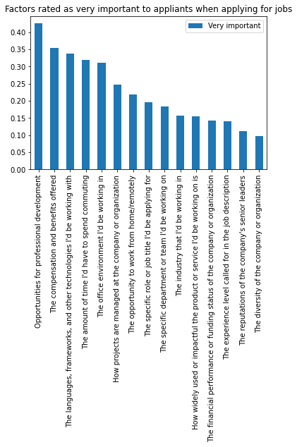
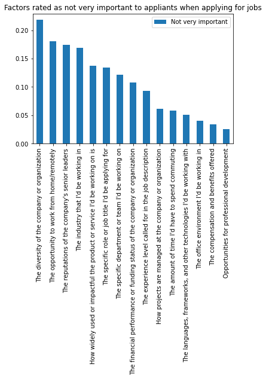
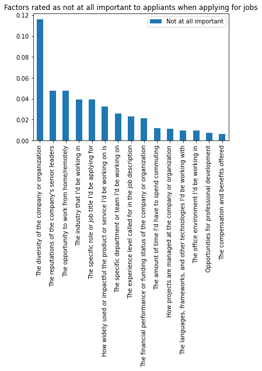
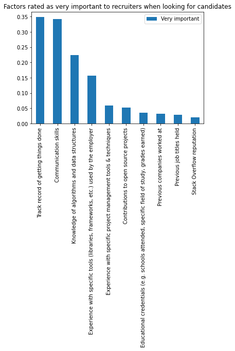
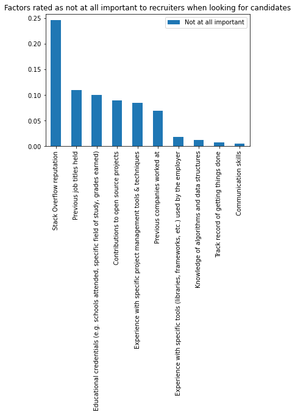
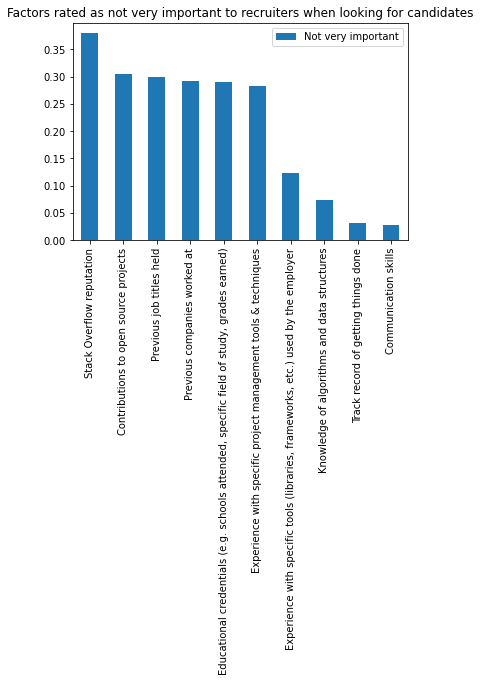

### What matters and what does not when programmers do job searching

1. What do programmers look for in job opportunities
2. If programmers were recruiters, what do they look for in potential candidates
3. What is deemed as not important to recruiters so candidates can have less focus on when preparing for job interviews

With StackOverflow Survey data, I'm interested in answers to these two questions: 
> 'When you're assessing potential jobs to apply to, how important are each of the following to you?'
> 'How important should each of the following be in Globex's hiring process?'

# Part I: What do programmers look for in job opportunities
The question 'When you're assessing potential jobs to apply to, how important are each of the following to you?' has follow-up choices to evaluate importance level:
There were 15 options and total of 20661 valid respondents

> The industry that I'd be working in,
 "The specific role or job title I'd be applying for",
 'The experience level called for in the job description',
 "The specific department or team I'd be working on",
 "The languages  frameworks  and other technologies I'd be working with",
 'How projects are managed at the company or organization',
 'The compensation and benefits offered',
 "The office environment I'd be working in",
 "The amount of time I'd have to spend commuting",
 'The opportunity to work from home/remotely',
 "The reputations of the company's senior leaders",
 'Opportunities for professional development',
 'The diversity of the company or organization',
 "How widely used or impactful the product or service I'd be working on is",
 'The financial performance or funding status of the company or organization']

Reading the top 5 factors applicants care about when applying, over 40% of respondents rate 'Opportunities for professional development' as 'Very Important' and thsi shows when applicants consider applying jobs, they are extremely future-oriented and look for potentials in a company.

32% respondents rated 'The amount of time I'd have to spend commuting' and 31% rated 'The office environment I'd be working in' as very important. This highlights the trade-offs between the attractiveness of office environment and how much commute it takes to get there. These were factors not relevant to the nature of work but definitely shows the fact 'we are all human' and is percetiple of all the things come with 'going to work'.

To my surprise, 'The diversity of the company or organization' was the top factors rated as 'Not Important', which is not aligned with current social movement. One fact to take into consideration is, generally speaking, engineers are a very diverse group already. Is it one of the job categories that contain heighst concernstation of international students and workers. However, this also insinuates social movement doesn't necessarily modify our expecations about workplace.

This survey was a little outdated and with pandemic a lot of people prefer flexibilities with their 'The opportunity to work from home/remotely', it would be interesting to see updated results, to similar group of respondents, their opinion towards remote work opportunities.

# Part II: If programmers were recruiters, what do they look for in potential candidates
The question 'How important should each of the following be in Globex's hiring process?' has follow-up choices to evaluate importance level:
There were 10 options and total of 27170 valid respondents.

>'Knowledge of algorithms and data structures',
 'Experience with specific tools (libraries  frameworks  etc.) used by the employer',
 'Communication skills',
 'Contributions to open source projects',
 'Experience with specific project management tools & techniques',
 'Previous companies worked at',
 'Previous job titles held',
 'Educational credentials (e.g. schools attended  specific field of study  grades earned)',
 'Stack Overflow reputation',
 'Track record of getting things done'
 
 
 
 
Reading the top factors rated as 'Very important' if an engineer is put as recruiter, 'Track record of getting things done' and 'Communication skills' were the most important. These two factors highlight the actual ability to thrive in a collaborative environment and carry it through to accomplish tasks or projects.

Factors that are traditionally sought after and are listed on our resume, such as educational credentials, previous job titles and companies, were actually not as important.

# Part III: What is deemed as not important to recruiters so candidates can have less focus on when preparing for job interviews

 

 

As for factors rated not as important or not at all important to recruitment, 'Stack Overflow reputation', 'previous job titles held', 'Educational crendnetials', and 'Contributions to open source projects'.

These all highlights that programming is a such a job that focuses on 'hands-on project experience', instead of online prescense or shiny history on your resume. What carries beyond your resume is your knowledge in solving real problems.

# Summary
To summarize, 'Opportunities for professional development', 'The amount of time I'd have to spend commuting' and 31% rated 'The office environment I'd be working in' 32% respondents rated as very important. This highlights the trade-offs between the attractiveness of office environment and how much commute it takes to get there. These were factors not relevant to the nature of work but definitely shows the fact 'we are all human' and is percetiple of all the things come with 'going to work'.

To see more about this analysis, see the link to my Github available [here](https://github.com/mikkodong/udacitynanodegree/blob/master/Udacity_JobCandidatesFactorImportantce.ipynb).

 
